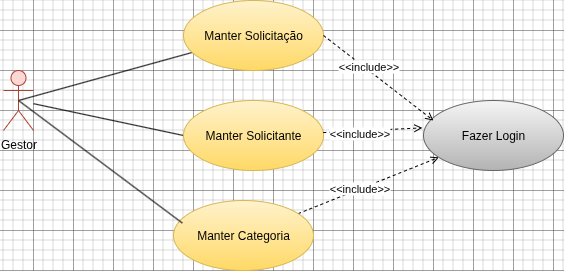
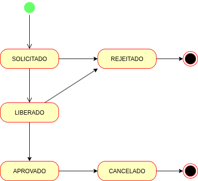
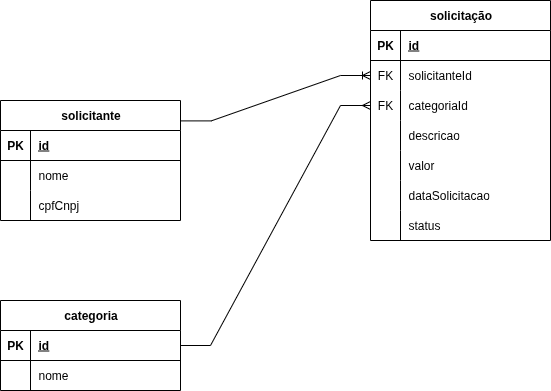

# Request Manager

Sistema de gerenciamento de solicitações de pagamento com API REST e interface web moderna, desenvolvido usando Spring Boot/Java e Vue/TypeScript.

## Tela Inicial
<video src="./docs/assets/app-video.mp4" width="100%" poster="./docs/assets/home_page.png"></video>


## 📋 Requisitos do Sistema

### Para toda a aplicação
- **Git** - Para clonar e gerenciar o repositório

### Para a API (`request-manager-api`)
- **Java 21** - Desenvolvida com Spring Boot 4.0.6
- **Maven** - Build tool (incluído com o `mvnw`)
- **Docker** e **Docker Compose** (obrigatório) - Para executar o banco de dados MySQL em contêineres

### Para a Aplicação Web (`payment-request-manager-app`)
- **Node.js** - Versão 20.19.0 ou superior, ou 22.12.0 ou superior
- **npm** - Gerenciador de pacotes (incluído com Node.js)

### Scripts do banco de dados 
- O script de criação do banco está na pasta Database na raiz do repositório.
- O arquivo de inserção de dados está na pasta resources do projeto da API.

## 🚀 Como Executar a Aplicação

### Opção 1: Execução Local (Recomendado para Desenvolvimento)

#### 1. Preparar a API
```bash
# Navegue até a pasta da API
cd request-manager-api

# Instale e compile o projeto (apenas na primeira vez)
./mvnw clean install

# Execute a API
./mvnw spring-boot:run
```

A API estará disponível em `http://localhost:5000`

#### 2. Preparar a Aplicação Web (em outro terminal)
```bash
# Navegue até a pasta da aplicação web
cd payment-request-manager-app

# Instale as dependências (apenas na primeira vez)
npm install

# Execute o servidor de desenvolvimento
npm run dev
```

A aplicação web estará disponível em `http://localhost:5173` (ou outro porta informada pelo Vite)

#### 3. Acessar a Aplicação
Abra o navegador e acesse: `http://localhost:5173`


## 📁 Estrutura do Projeto

```
request-manager/
├── request-manager-api/          # API REST em Spring Boot
│   ├── src/
│   │   ├── main/java/            # Código-fonte da API
│   │   └── resources/            # Arquivos de configuração
│   ├── pom.xml                   # Configuração Maven
│   └── mvnw                       # Maven Wrapper
│
└── payment-request-manager-app/  # Frontend em Vue.js + TypeScript
    ├── src/
    │   ├── components/           # Componentes Vue
    │   ├── views/                # Páginas/Views
    │   ├── router/               # Configuração de rotas
    │   ├── types/                # Tipos TypeScript
    │   └── assets/               # Assets estáticos
    ├── package.json              # Dependências npm
    └── vite.config.ts            # Configuração do Vite
```

#### Casos de Uso


#### Transição de Status das Solicitações
Como o diagrama abaixo ilustra, o status de uma solicitação de pagamento pode assumir diversos estados. Toda solicitação inicia com o status `SOLICITADO` e pode chega ao estágio final com o status `REJEITADO` ou `CANCELADO`.



#### Modelo de Dados




## 🔌 Portas Padrão

- **API Rest**: `http://localhost:5000`
- **Aplicação Web**: `http://localhost:5173` 

## 🐛 Troubleshooting

### Problema: "Maven não encontrado"
**Solução**: Use `./mvnw` (no Linux/Mac) ou `mvnw.cmd` (no Windows)

### Problema: "Porta 5000 já está em uso"
**Solução**: Altere a porta no arquivo `request-manager-api/src/main/resources/application.properties`:
```properties
server.port=8081
```

### Problema: "npm: comando não encontrado"
**Solução**: Instale Node.js da versão recomendada em `https://nodejs.org/`

### Problema: "HOST_PORT do container do MySQL já está em uso"
Esse problema ocorre quando o docker inicializa o serviço do Mysql e tenta reservar a porta 3000 (como mostra o exemplo) do computador. Porém, ela já está em uso por outro programa, impedindo assim, a conexão entre o container e a máquina. 

**Solução**: Acesse o arquivo `docker-compose.yml` e altere a propriedade `ports` do serviço do MySQL. O HOST_PORT fica localizado antes dos dois pontos, como mostra o exemplo abaixo ⬇️.

**Exemplo**:
```
    ports:
        3000:3603    # HOST_PORT : CONTAINER_PORT
```

### Problema: "Erro ao conectar com a API"
**Solução**: Verifique se a API está rodando em `localhost:5000` e ajuste a URL base no arquivo de configuração da aplicação web se necessário.

## 📚 Documentação Adicional

- [API Documentation](./request-manager-api/README.md)
- [Frontend README](./payment-request-manager-app/README.md)

## 👨‍💻 Desenvolvedor

Gabrielx47

## 📝 Licença

Este projeto é de código aberto.